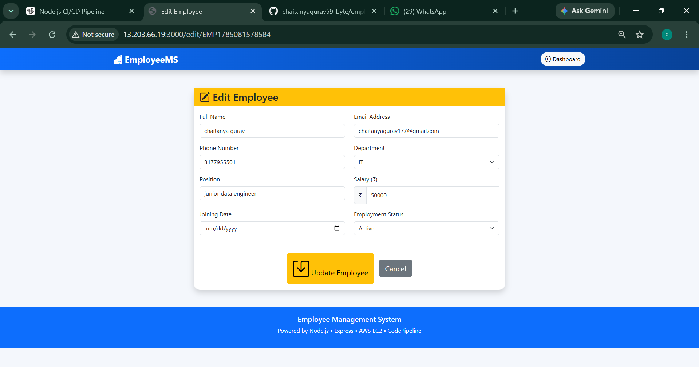
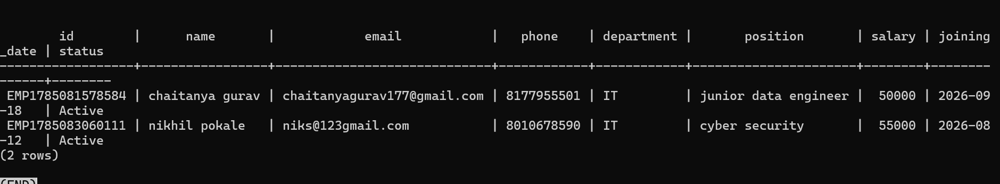
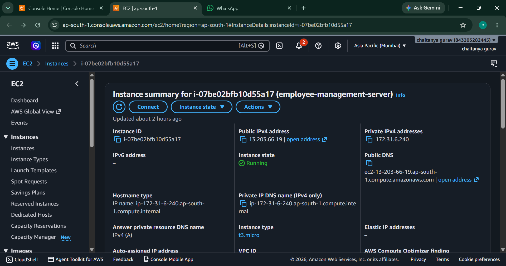
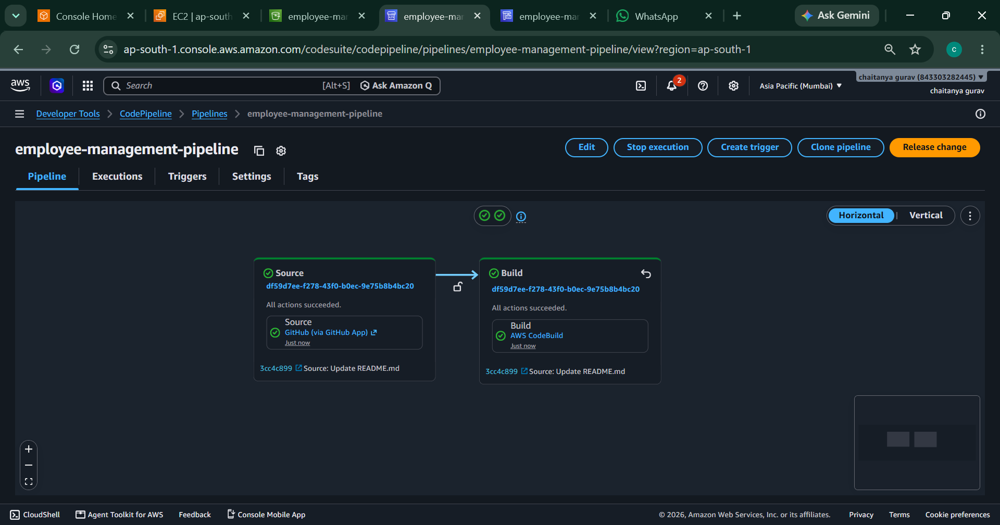

# 👨‍💼 Employee Management System with AWS CI/CD


---

# 🚀 Project Overview

The **Employee Management System** is a cloud-based CRUD web application developed using **Node.js**, **Express.js**, **PostgreSQL**, and **Bootstrap**.

The application allows organizations to manage employee information efficiently through an intuitive web interface. It supports adding, editing, deleting, and searching employee records while securely storing the data in PostgreSQL.

The project is deployed on an **AWS EC2** instance and integrated with **GitHub**, **AWS CodePipeline**, and **AWS CodeBuild** to automate the Continuous Integration (CI) workflow.

---

# ❗ Business Problem

Many organizations still manage employee information using spreadsheets or paper records.

This creates several challenges:

- ❌ Duplicate employee records
- ❌ Manual data entry
- ❌ Slow searching
- ❌ Difficult maintenance
- ❌ No centralized database
- ❌ Time-consuming HR operations

---

# ✅ Solution

The Employee Management System provides:

- ✅ Employee Registration
- ✅ Employee Update
- ✅ Employee Search
- ✅ Employee Deletion
- ✅ PostgreSQL Database Integration
- ✅ Responsive Bootstrap UI
- ✅ Cloud Deployment on AWS EC2
- ✅ Continuous Integration using GitHub + AWS CodePipeline + CodeBuild

---

# 🏗️ Architecture Diagram

> *(You can add an architecture diagram later.)*

---

# ⚙️ Application Architecture

```text
                    User
                      │
                      ▼
                 Web Browser
                      │
                      ▼
         Node.js + Express.js (EC2)
                      │
                      ▼
              PostgreSQL Database
```

---

# 🔄 CI/CD Pipeline

```text
Developer
     │
     ▼
GitHub Repository
     │
     ▼
AWS CodePipeline
     │
     ▼
AWS CodeBuild
     │
     ▼
Build & Test
     │
     ▼
AWS EC2
     │
     ▼
Employee Management System
```

---

# 📸 Project Screenshots

## 🏠 Dashboard


---

## 👨‍💼 Administrator Profile


---

## ✏️ Edit Employee



---

## 🗄️ PostgreSQL Database



---

## ☁️ AWS EC2 Instance



---

## 🚀 AWS CodePipeline Execution



---

# ✨ Features

- ✅ Add Employee
- ✅ Edit Employee
- ✅ Delete Employee
- ✅ Search Employee
- ✅ Administrator Dashboard
- ✅ PostgreSQL Integration
- ✅ Responsive Bootstrap Design
- ✅ RESTful CRUD Operations
- ✅ Cloud Deployment
- ✅ CI Pipeline using AWS

---

# ☁️ AWS Services Used

## Amazon EC2

Purpose:

- Host the Employee Management System
- Run the Express.js server

---

## AWS CodePipeline

Purpose:

- Detect GitHub changes
- Trigger Continuous Integration
- Automate build workflow

---

## AWS CodeBuild

Purpose:

- Install dependencies
- Run automated tests
- Validate application

---

## IAM

Purpose:

- Manage AWS permissions securely

---

## Amazon CloudWatch

Purpose:

- Store build logs
- Monitor pipeline execution

---

# 🔄 Application Workflow

### Step 1

User opens the Employee Management System.

### Step 2

Employee information is entered or updated.

### Step 3

Express.js processes the request.

### Step 4

Data is stored or retrieved from PostgreSQL.

### Step 5

Developers push code changes to GitHub.

### Step 6

AWS CodePipeline detects repository changes.

### Step 7

AWS CodeBuild installs dependencies and runs tests.

### Step 8

The latest application version is ready for deployment.

---

# 🧪 Testing

Run tests locally:

```bash
npm test
```

---

# 🛠️ Tech Stack

### Frontend

- HTML5
- CSS3
- Bootstrap 5
- EJS

### Backend

- Node.js
- Express.js

### Database

- PostgreSQL

### Cloud Services

- AWS EC2
- AWS CodePipeline
- AWS CodeBuild
- IAM
- CloudWatch

### Version Control

- Git
- GitHub

---

# 📂 Project Structure

```text
employee-management-system
│
├── public/
├── views/
├── screenshots/
├── tests/
├── scripts/
├── app.js
├── db.js
├── buildspec.yml
├── appspec.yml
├── package.json
├── README.md
└── .gitignore
```

---

# 🚀 Installation

Clone the repository

```bash
git clone https://github.com/chaitanyagurav59-byte/employee-management-system.git
```

Move into the project

```bash
cd employee-management-system
```

Install dependencies

```bash
npm install
```

Configure PostgreSQL in `db.js`.

Run the application

```bash
node app.js
```

Open your browser

```
http://localhost:3000
```

---

# 🎯 Skills Learned

- Node.js
- Express.js
- PostgreSQL
- Bootstrap
- AWS EC2
- AWS CodePipeline
- AWS CodeBuild
- GitHub
- Continuous Integration
- Cloud Deployment

---

# 🌍 Real-World Use Cases

- Employee Management Systems
- HR Management Portals
- Internal Enterprise Applications
- CRUD-Based Web Applications
- Cloud-Based Business Solutions

---

# 🚀 Future Improvements

- Authentication & Authorization
- Role-Based Access Control
- Docker Containerization
- Kubernetes Deployment
- Amazon RDS
- Email Notifications
- Dashboard Analytics

---

# 📊 Project Outcome

Successfully built a cloud-hosted Employee Management System with an automated CI pipeline.

Achievements:

- ✔ Full CRUD functionality
- ✔ PostgreSQL database integration
- ✔ AWS EC2 deployment
- ✔ GitHub version control
- ✔ AWS CodePipeline integration
- ✔ AWS CodeBuild automation

---

# 👨‍💻 Author

**Chaitanya Gurav**

### GitHub

https://github.com/chaitanyagurav59-byte

---

# ⭐ Conclusion

This project demonstrates practical experience in **Full Stack Web Development**, **Cloud Computing**, and **DevOps**.

By combining **Node.js**, **Express.js**, **PostgreSQL**, **AWS EC2**, **AWS CodePipeline**, and **AWS CodeBuild**, the project showcases how modern organizations can build, manage, and continuously integrate cloud-hosted applications using AWS services.
