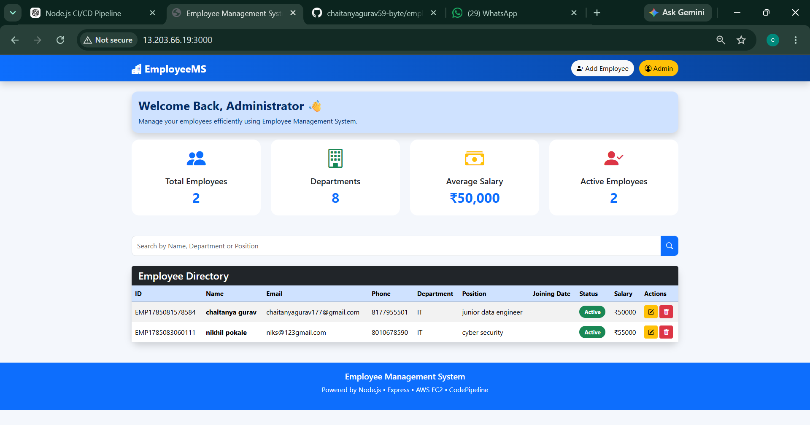
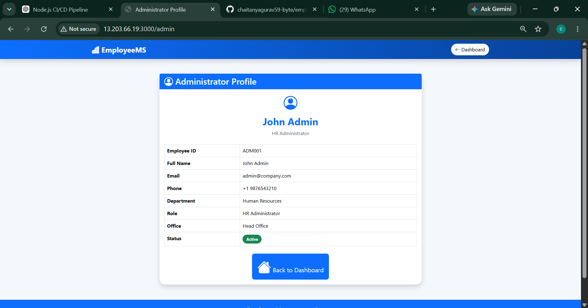

# Employee Management System

A full-stack Employee Management System built using **Node.js**, **Express.js**, **PostgreSQL**, **EJS**, and **Bootstrap**. The application allows users to manage employee records through a user-friendly web interface and is designed to be deployed on AWS EC2 with CI/CD using AWS CodePipeline.

---

## Features

- Add Employee
- View Employee List
- Edit Employee Details
- Delete Employee
- Search Employees
- Admin Dashboard
- PostgreSQL Database Integration
- Responsive Bootstrap UI

---

## Tech Stack

- Node.js
- Express.js
- PostgreSQL
- EJS
- Bootstrap 5
- HTML5
- CSS3
- JavaScript
- AWS EC2
- Git & GitHub
- AWS CodePipeline (In Progress)

---

## Project Structure

```
employee-management-system/
│── public/
│── views/
│── screenshots/
│── app.js
│── db.js
│── package.json
│── README.md
│── .gitignore
```

---

## Database

Database Name:

```
employee_db
```

Table:

```
employees
```

Columns:

- id
- name
- email
- phone
- department
- position
- salary
- joining_date
- status

---

## Screenshots

### Home Page



### Add Employee


### Edit Employee


### Search Employee


### Admin Page



### PostgreSQL Database


---

## Installation

Clone the repository

```bash
git clone <repository-url>
```

Install dependencies

```bash
npm install
```

Start PostgreSQL.

Run the application

```bash
node app.js
```

Open your browser

```
http://localhost:3000
```

---

## Future Enhancements

- User Authentication
- Role-Based Access Control
- Docker Support
- AWS CodePipeline CI/CD
- Unit Testing
- REST API

---

## Author

**Chaitanya Gurav**

Data Engineering | AWS | Node.js | PostgreSQL
